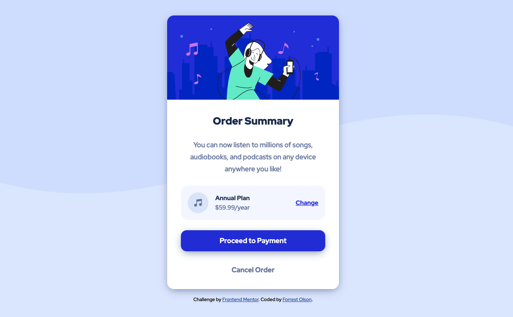

# Frontend Mentor - Order summary card solution

This is a solution to the [Order summary card challenge on Frontend Mentor](https://www.frontendmentor.io/challenges/order-summary-component-QlPmajDUj).
## Table of contents

- [Overview](#overview)
  - [The challenge](#the-challenge)
  - [Screenshot](#screenshot)
  - [Links](#links)
- [My process](#my-process)
  - [Built with](#built-with)
  - [Continued development](#continued-development)

## Overview

### The challenge

Building out a very simple order summary card using HTML + CSS.

Users should be able to:

- See a responsive design that adapts to the size of their viewport
- See hover states for interactive elements (buttons, links)

### Screenshot

### Links

- Solution URL: [GitHub repo](https://github.com/f0lson/order-summary-component/)
- Live Site URL: [Live site](https://f0lson.github.io/order-summary-component/)

## My process

### Built with

- Semantic HTML5 markup
- CSS custom properties
- Flexbox
- Mobile-first workflow

### Continued development

This was a very simple project so there isn't really much that I believe I could have done differently. Something to explore in the future would be to restructure the layout using CSS grid alongside Flexbox. 
